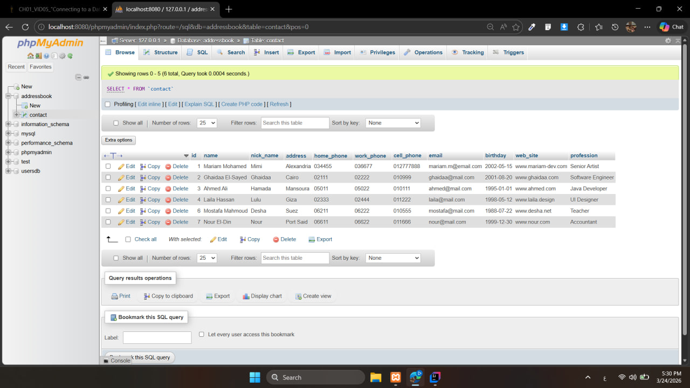

# Address Book System (Java JDBC)


Java JDBC & MySQL Address Book System


##  (Console Output):


```text

--- Starting Address Book System --- 


Adding 7 new contacts...

Contact Mariam Mohamed added successfully! 

Contact Ghaidaa El-Sayed added successfully! 

Contact Ahmed Ali added successfully! 

Contact Laila Hassan added successfully! 

Contact Omar Khalid added successfully! 

Contact Mostafa Mahmoud added successfully! 

Contact Nour El-Din added successfully! 


--- Initial Contacts List ---

ID: 1 | Name: Mariam Mohamed | Job: Artist

ID: 2 | Name: Ghaidaa El-Sayed | Job: Software Engineer

ID: 3 | Name: Ahmed Ali | Job: Java Developer

ID: 4 | Name: Laila Hassan | Job: UI Designer

ID: 5 | Name: Omar Khalid | Job: Civil Engineer

ID: 6 | Name: Mostafa Mahmoud | Job: Teacher

ID: 7 | Name: Nour El-Din | Job: Accountant


 Searching for 'Ghaidaa'...

ID: 2 | Name: Ghaidaa El-Sayed | Job: Software Engineer


 Updating Mariam Mohamed's details (ID: 1)...

Contact Mariam Mohamed updated successfully! 


 Attempting to delete contact with ID: 5...

Contact with ID 5 deleted successfully! 


 --- Final Contacts List After Operations ---

ID: 1 | Name: Mariam Mohamed | Job: Senior Artist

ID: 2 | Name: Ghaidaa El-Sayed | Job: Software Engineer

ID: 3 | Name: Ahmed Ali | Job: Java Developer

ID: 4 | Name: Laila Hassan | Job: UI Designer

ID: 6 | Name: Mostafa Mahmoud | Job: Teacher

ID: 7 | Name: Nour El-Din | Job: Accountant


Process finished with exit code 0


```
---
###  صورة قاعدة البيانات (MySQL):


###  ملف قاعدة البيانات:
المشروع يتضمن ملف `addressbook.sql` لتهيئة الجداول والبيانات.


